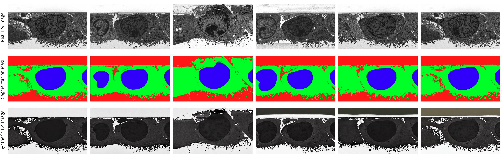

# From Natural to Nanoscale: Training ControlNet on Scarce FIB-SEM Data for Augmenting Semantic Segmentation Data
[](https://viscom.uni-ulm.de/publications/from-natural-to-nanoscale-training-controlnet-on-scarce-fib-sem-data-for-augmenting-semantic-segmentation-data/)
[]()
[](source/paper.pdf)

This repository contains the code for 

```
From Natural to Nanoscale: Training ControlNet on Scarce FIB-SEM Data for Augmenting Semantic Segmentation Data
Hannah Kniesel*, Pascal Rapp*, Pedro Hermosilla, Timo Ropinski
ICCVW BIC
```
, which is heavily based on and extends the official ControlNet [1] repository by Lvmin Zhang and Maneesh Agrawala. We are grateful for their foundational work.

Original ControlNet Repository: [https://github.com/lllyasviel/ControlNet](https://github.com/lllyasviel/ControlNet)



*Representative samples from the dataset, shown alongside their corresponding color-coded segmentation masks used to condition
ControlNet, and the resulting synthetic images. The visual consistency across samples (columns) highlights the low variability within the
dataset. Despite visible differences between real (row 1) and synthetic (row 3) data, our quantitative experiments demonstrate that the
U-Net can still extract valuable image features from the synthetic samples.*

---
[1] Zhang, Lvmin, Anyi Rao, and Maneesh Agrawala. "Adding conditional control to text-to-image diffusion models." Proceedings of the IEEE/CVF international conference on computer vision. 2023.

## Setup
### ✅ Requirements Summary

- Python: `3.10.13`
- CUDA: `12.1`
- cuDNN: `8.9`
- PyTorch: `2.1.1`
- torchvision: `0.16.1`

---

### 🔧 Option 1: Docker
You can download the docker image directly:
```bash
docker run --gpus all -v $PWD:/workspace -it hannahkniesel/natural2nanoscale:latest bash
```

Or build your own: 
```bash
docker build -t natural2nanoscale .
docker run --gpus all -v $PWD:/workspace -it natural2nanoscale:bash
```

Make sure you have Docker ≥ 20.10 and the NVIDIA Container Toolkit installed.

---

### ⚙️ Option 2: Virtualenv + pip

```bash
python3 -m venv env
source env/bin/activate
pip install --upgrade pip
pip install torch==2.4.1 torchvision==0.19.1 torchaudio==2.4.1 --index-url https://download.pytorch.org/whl/cu124
pip install -r req.txt
```

---

## Model Weights and Data
You can download the all model weights [here](https://viscom.datasets.uni-ulm.de/Natural2Nanoscale/Weights.zip).

If you wish to only download our pretrained controlnet, you can do this [here](https://viscom.datasets.uni-ulm.de/Natural2Nanoscale/ControlNet-Weights.zip)

You can download the generated images and corresponding masks [here](https://viscom.datasets.uni-ulm.de/Natural2Nanoscale/Generated.zip).

The real images originate from Dataset 1 of Devan et al [2]. The data can be found [here](https://data.mendeley.com/datasets/9rdmnn2x4x/1).

---
*[2] Shaga Devan, Kavitha, et al. "Weighted average ensemble-based semantic segmentation in biological electron microscopy images." Histochemistry and Cell Biology 158.5 (2022): 447-462.*

## Train ControlNet
You will need to download the initial sd1.5 checkpoint. There are two options to do this:
1.  You can download `v1-5-pruned.ckpt` from [here](https://huggingface.co/stable-diffusion-v1-5/stable-diffusion-v1-5/tree/main) and move it to the `models` directory. Then run `python tool_add_control.py ./models/v1-5-pruned.ckpt ./models/control_sd15_ini.ckpt` to prepare the checkpoint for the controlnet architecture.

2. Otherwise, when you download our controlnet model weights (see above), you can use the checkpoint at `ControlNet-Weights/control_sd15_ini.ckpt`.

Next, if you wish to train your own ControlNet, similar as to the one in the paper, run: 
```bash
python train.py \
    --batch_size 2 \
    --learning_rate 1e-5 \
    --image_path /path/to/my/images \
    --mask_path /path/to/my/masks \
    --resume ./models/control_sd15_ini.ckpt \
    --gpus 1 \
    --precision 32 \
    --wandb_api_key YOUR_WANDB_KEY_HERE
```

*Please note that the code currently only supports encoding of three classes.*
Model weights and log images will be saved at `./models/timestamp`. 

## Generate Images
To generate images with a pretrained ControlNet do: 
```bash
python generate.py \
    --config_yaml_path ./models/cldm_v15.yaml \
    --model_weights_path ./models/EM_best_results.ckpt \
    --mask_dir /path/to/my/segmentation/masks \
    --output_base_dir ./my_synth_data \
    --n_augmentations_per_mask 1 \
    --batch_size_per_inference 1 
```


